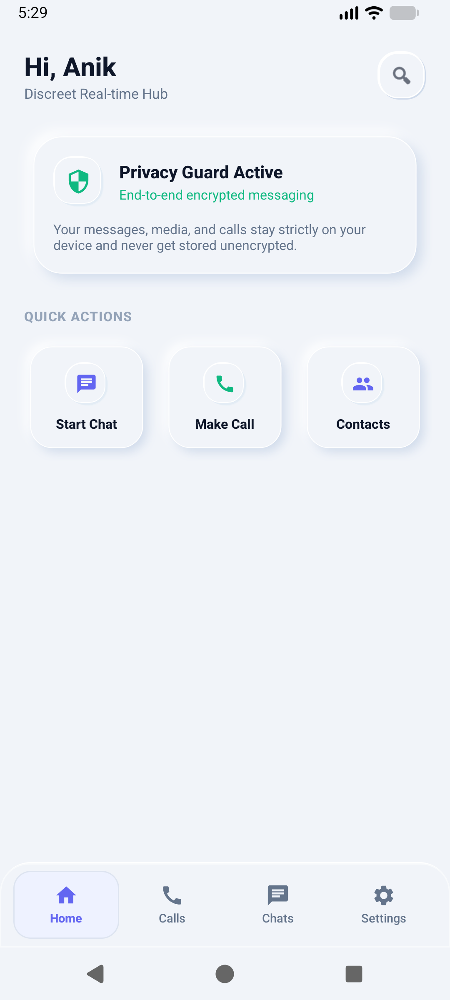
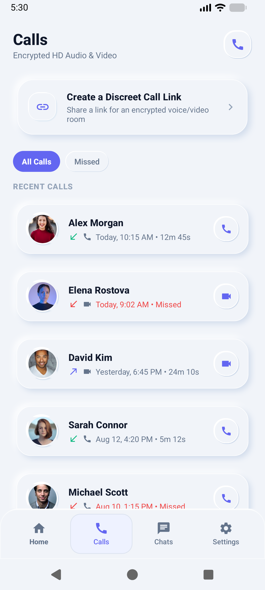
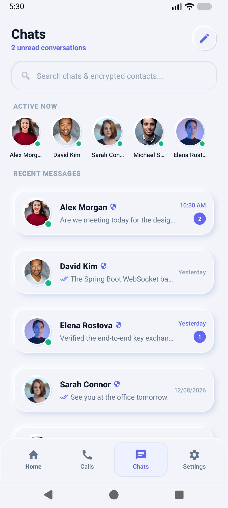
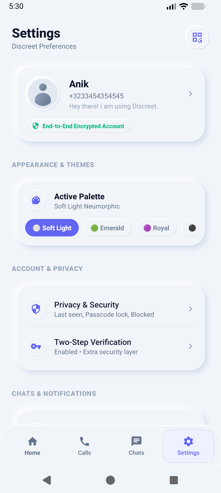
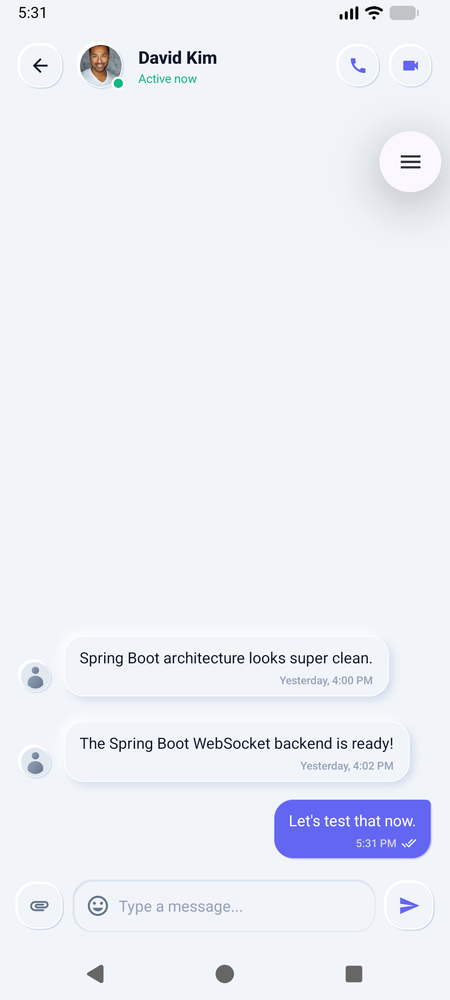

# Discreet 💬🛡️

> **A privacy-first, zero-knowledge real-time messaging application with a tactile Neumorphic design system.**

---

## 📸 App Screenshots

<p align="center">
  
  
  
  
  
</p>

---

## 🌟 Key Features

* **Zero-Knowledge Persona Creation**: Get started in seconds with a private cryptographic handle without needing a phone number, SMS verification, or email.
* **Tactile Neumorphic Design**: Built from the ground up with soft porcelain surfaces (`#F1F4F9`), dual-tone ambient lighting, and optical Gaussian drop shadows.
* **Interactive Onboarding Carousel**: 3-step feature showcase highlighting end-to-end security, public shield mode, and disposable ephemeral rooms.
* **Encrypted 1-on-1 Chat Conversations**: Direct messaging with real-time message stream, read receipts, and media attachments.
* **Contacts & Active Presence**: Contacts directory with live search and real-time active status dots.
* **Calls History**: Logged call tracking with audio/video indicators and directional status.
* **Custom Profile & Settings**: Granular control over display name, bio, avatar selection, and secure session reset.

---

## 🏗️ Architecture & Tech Stack

### Android Client (`/android`)
* **Language & SDK**: Java / Android SDK (Min API 24, Target API 34)
* **Architecture**: Android Architecture Components **MVVM (Model-View-ViewModel)** + **Repository Pattern**
* **State Management**: Reactive `LiveData` streams and `ViewModelProvider`
* **UI & View Binding**: Android DataBinding, Material Design 3, custom `NeumorphCardView`
* **Image Loading**: Glide
* **Vector Graphics**: Infinite-resolution vector drawables and adaptive launcher icons

### Backend Server (`/backend`) *(Phase 2)*
* **Framework**: Spring Boot 3.x (Java 21)
* **Security**: Spring Security + JWT Authentication
* **Real-Time Transport**: Spring WebSocket with STOMP protocol
* **Database & ORM**: PostgreSQL + Spring Data JPA
* **Object Storage**: MinIO / AWS S3 (Encrypted media storage)

---

## 📁 Project Structure

```text
discreet/
├── android/                                    # Android Native Client
│   └── app/src/main/
│       ├── java/com/example/chatapplication/
│       │   ├── adapter/                       # RecyclerView & ViewPager adapters
│       │   ├── common/view/                   # Custom NeumorphCardView & UI widgets
│       │   ├── data/                          # SessionManager (Preferences & Auth state)
│       │   ├── model/                         # Domain entities (User, ChatMessage, etc.)
│       │   ├── repository/                    # Repository contracts & implementations
│       │   ├── view/                          # Activities & Fragments (4 main tabs)
│       │   └── viewmodel/                     # LiveData ViewModels (Chats, Calls, etc.)
│       └── res/
│           ├── drawable/                      # Vector drawables & Neumorphic selectors
│           ├── layout/                        # Standardized data-bound XML layouts
│           └── values/                        # Color palette & styling tokens
├── backend/                                   # Spring Boot 3 Backend Server
└── README.md
```

---

## 🚀 Getting Started

### 1. Android Client Setup
```bash
# Navigate to the Android directory
cd android

# Build Debug APK
./gradlew assembleDebug

# Install on connected device/emulator
./gradlew installDebug
```

### 2. Backend Server Setup
```bash
# Navigate to the backend directory
cd backend

# Run Spring Boot Application
./mvnw spring-boot:run
```

---

## 📄 License
This project is licensed under the MIT License - see the [LICENSE](LICENSE) file for details.
